# Lucid — Enterprise Personal Super Agent

## What It Is

Lucid is a **privately deployable SaaS personal super agent**. Like other personal AI assistants, it can handle conversations, execute code, and automate tasks. However, Lucid is specifically designed for SaaS deployment, making it ideal for internal enterprise use.

Compared to other personal AI assistants, Lucid balances powerful flexibility with enterprise-grade security — eliminating risks such as accidental deletion of local files, execution of dangerous commands, and security issues when the agent interacts with internal business systems.

The current version runs on a single machine (local or server), but with minimal adaptation it can support server-side execution on a PaaS platform with the frontend running in a personal browser. It already implements user-based session isolation, short/long-term memory, scheduled tasks, notifications, and custom skill isolation — achieving stateless, SaaS-ready agent execution.

> **Note:** The current stage of this project is deployed on a Mac. Server-side deployment is planned for a future release. However, if you'd like to deploy it on a server right now, it's straightforward — simply update the connection information for frontend → Lucid and Lucid → Redis/MySQL, then deploy to a pod.

## What You Can Do

### Daily Conversations
You can chat with Lucid as shown below:

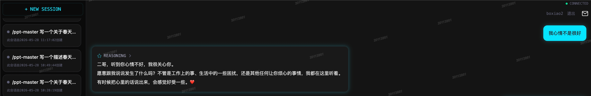

### Autonomous Tasks
You can tell it: "Research the price trends of seafood in Qingdao," as shown below:
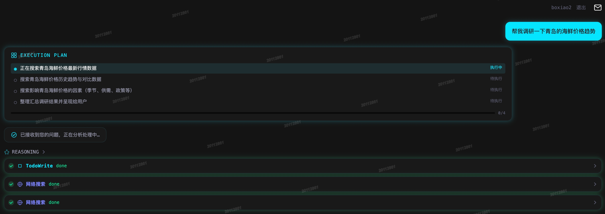
It will actively analyze the task complexity, break it down into subtasks, and invoke tools to complete them step by step. If issues arise during execution, it will proactively attempt to fix them. Once the task is complete, results are streamed back to you in real time:


### SaaS Scheduled Tasks
What sets Lucid apart from other personal AI assistants is its SaaS-native scheduled task system. The challenge lies in the stateless nature of agent instances — the system must accurately extract user-related state (such as memories), execute the scheduled task, and reliably deliver results to the user.

You can create and manage scheduled tasks using **natural language** or the UI, as shown below:
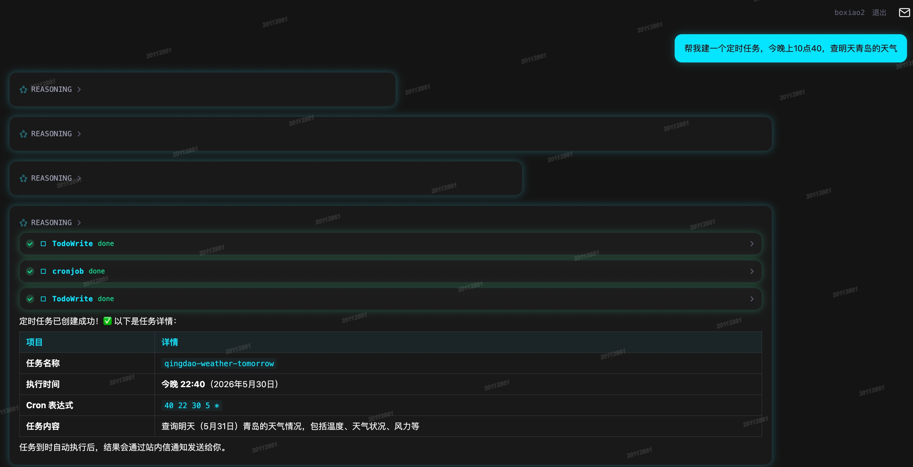
You can then view your scheduled tasks in the cron management interface:
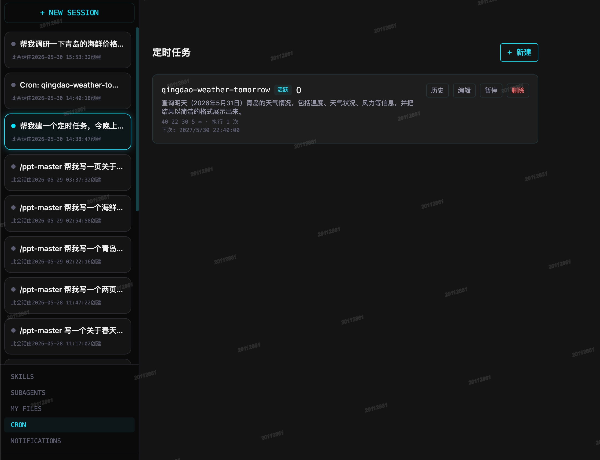
When a scheduled task triggers, you'll see a red dot badge on the notification inbox in the top-right corner of the page. Click to view the execution results:
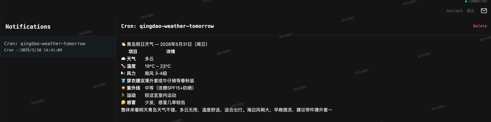
Scheduled tasks have their own isolated sessions, so you can review the execution process:
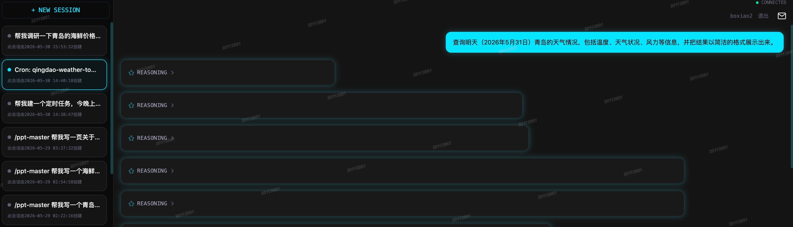

### Using Preset Skills
The challenge with SaaS super agent skills is file persistence. If a skill produces a file (e.g., a PPT), and the agent instance is stateless, a SaaS file system is essential for persistent storage.

Here, a user initiates a PPT creation task using the ppt-skill:
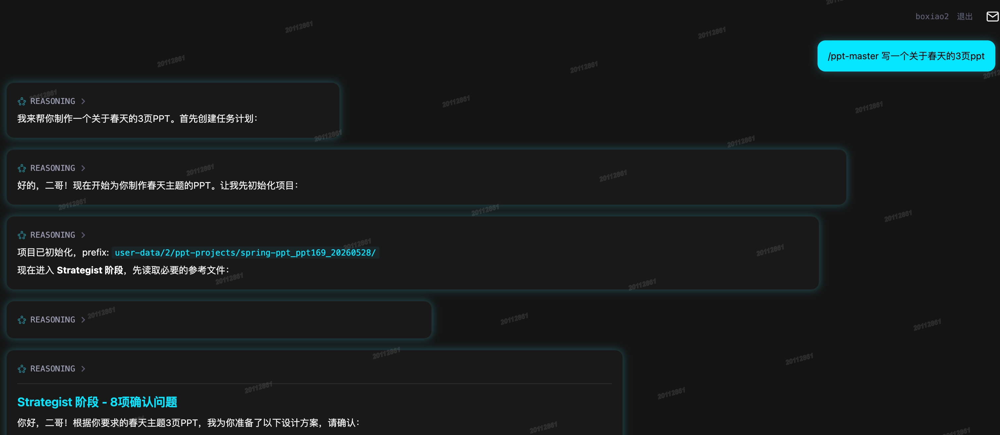
After task decomposition and tool execution, the PPT generation result is shown:
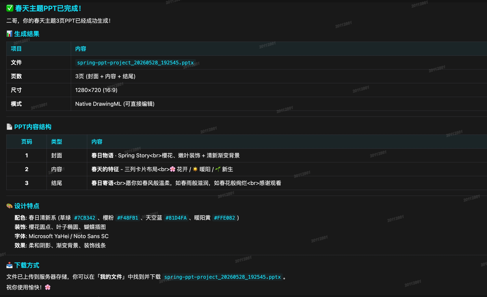
The final PPT file is visible in the file management page:
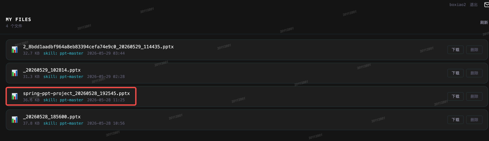

### Using Preset Sub-Agents
Users can compose sub-agent components into temporary or permanent agent teams for discussions and planning.

When the result is a file, the same SaaS persistence challenge applies, and the solution is similar to skills. When the result is text, it is streamed back to the user in real-time within the conversation flow.

### Creating and Using Custom Skills
This feature is not yet implemented. Stay tuned.

### Creating and Using Custom Sub-Agents
This feature is not yet implemented. Stay tuned.

### Viewing Notifications
Message entry points are available in both the top-right and bottom-left corners of the UI. All messages generated by the super agent are displayed here, including text messages and messages with file links. When new messages arrive, the inbox icon in the top-right corner shows a red dot badge:
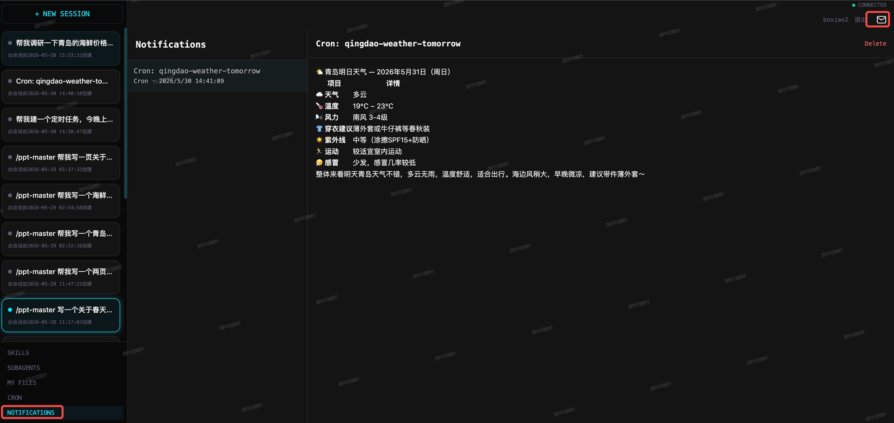

### Viewing Files Generated by Lucid
The UI has a dedicated file management page where you can download or delete files generated by the super agent:
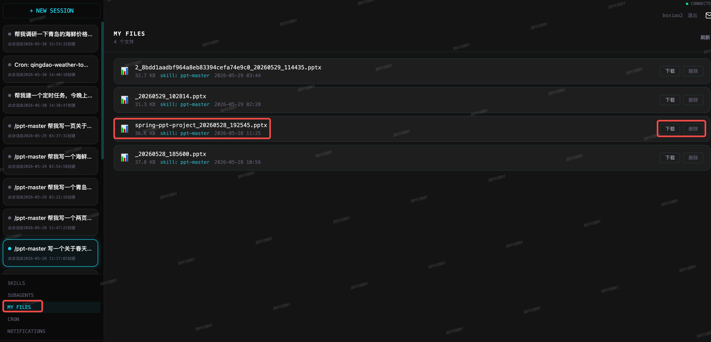

## Core Features

### 🧠 Agent with Memory

No more starting from scratch with every conversation. Lucid automatically extracts key information from conversations to form short-term memory (STM), and periodically consolidates it into long-term memory (LTM) in the background. In subsequent conversations, it retrieves relevant context from memory and injects it into the prompt — including when executing scheduled tasks.

### ⏰ Native SaaS Architecture

This is Lucid's most important differentiator from other personal AI assistants. It follows standard SaaS design principles: the service is stateless, and the data layer is indexed and isolated by `employee_id`.

Its conversation data, short/long-term memory data, personal inbox data, personal file data, scheduled task configurations, and scheduled task executions are all stored in a SaaS-native manner.

### Enterprise-Grade Security

Lucid was designed from the ground up with enterprise use cases in mind, incorporating multiple security measures:

- **Agent Runtime Security**: The agent runtime environment is stateless — it does not write, modify, or delete any data in the runtime environment. Because this environment is standard and stateless, it inherently contains no enterprise or personal sensitive data. This natively eliminates risks such as accidental local file deletion that plague other personal assistants.
- **Security of Other Enterprise Systems**: Enterprises typically have many internal business systems. A super agent with high privileges could pose a catastrophic risk to these systems. Lucid addresses this through an employee digital twin architecture — integrating with the enterprise's account and permission system, it uses the employee's digital twin to interact with internal business systems with appropriate access controls.

## Tech Stack

| Layer | Technology |
|------|------|
| Backend Framework | Python FastAPI |
| Async Tasks | Celery + Redis |
| Database | MySQL 8.0 (aiomysql) |
| Cache | Redis 7 |
| Search Engine | Elasticsearch 8 |
| Object Storage | MinIO (S3-compatible) |
| Container Isolation | Docker SDK for Python |
| Frontend | React 19 + TypeScript + Tailwind CSS 4 + Vite 6 |
| Real-Time Communication | Server-Sent Events (SSE) |

## Installation & Running

### 1. Prerequisites

#### 1.1 Required Software

| Software | Minimum Version | Purpose | Verify |
|------|---------|------|----------|
| Docker | 20.10+ | Run MySQL, Redis, ES, MinIO, scheduler containers | `docker --version` |
| Docker Compose | v2.0+ | Orchestrate multi-container services | `docker compose version` |
| Python | 3.11+ | Run FastAPI backend service | `python3 --version` |
| Node.js | 18+ | Build frontend React application | `node --version` |
| npm | 9+ | Install frontend dependencies | `npm --version` |
| pip | 23+ | Install Python dependencies | `pip3 --version` |

#### 1.2 Docker Container Services

The following containers will run in Docker after deployment:

| Container | Image | Port | Purpose |
|------|------|------|------|
| mysql | mysql:8.0 | 3306 | Business database — users, sessions, scheduled tasks, memory, etc. |
| redis | redis:7-alpine | 6379 | Cache + Celery message broker |
| elasticsearch | elasticsearch:8.13.4 | 9200 | Full-text message search engine |
| minio | minio/minio | 9000 / 9001 | Object storage (file artifacts) + web console |
| scheduler-beat | Project build | — | Celery beat scheduler, scans for due tasks every 30s |
| scheduler-worker | Project build | — | Celery task executor, dispatches to backend via HTTP |
| super-agent-nginx | nginx:alpine | 3000 | Frontend static files + API reverse proxy |

#### 1.3 Port Usage

Ensure the following ports are available before deployment:

| Port | Service | If Conflicted |
|------|------|-------------|
| 3000 | Frontend (Nginx) | Modify `listen` port in `nginx/nginx.conf` |
| 3306 | MySQL | Stop local MySQL first if running |
| 6379 | Redis | Stop local Redis first if running |
| 8000 | FastAPI Backend | Modify startup port in `deploy.sh` |
| 9000 | MinIO API | Modify in `docker-compose.yml` |
| 9001 | MinIO Console | Modify in `docker-compose.yml` |
| 9200 | Elasticsearch | Modify in `docker-compose.yml` |

### 2. Required Configuration

#### 2.1 LLM Configuration (Required)

Lucid does not provide an LLM — you need to connect your own LLM API. Configure the following in `.env`:

```bash
# ── LLM API Base URL ──
# Alibaba Cloud Bailian (DeepSeek, etc.)
OPENAI_API_BASE=https://dashscope.aliyuncs.com/compatible-mode/v1
# OpenAI Official
# OPENAI_API_BASE=https://api.openai.com/v1
# Any OpenAI-compatible API service works

# ── API Keys (supports multiple, comma-separated or JSON array) ──
OPENAI_API_KEYS=["sk-your-api-key-here"]

# ── Model Names ──
DEFAULT_MODEL=deepseek-v4-pro          # Default model for the agent
DEFAULT_DELEGATE_MODEL=deepseek-v4-pro # Model for sub-agents
COMPRESS_MODEL=deepseek-v4-pro         # Model for context compression

# ── Available Models (JSON array) ──
AVAILABLE_MODELS=["deepseek-v4-pro"]

# ── Model Fallback Chain (JSON object, auto-switch when model is unavailable) ──
FALLBACK_CHAIN={"deepseek-v4-pro":[]}
```

#### 2.2 Embedding Model Configuration (Optional, for enhanced memory search)

```bash
EMBEDDING_MODEL=text-embedding-3-small    # Embedding model name
EMBEDDING_API_BASE=                       # Embedding API base URL, defaults to OPENAI_API_BASE if empty
EMBEDDING_API_KEY=                        # Embedding API key, defaults to OPENAI_API_KEYS[0] if empty
EMBEDDING_DIM=2560                        # Embedding vector dimension
```

#### 2.3 Object Storage Configuration

```bash
# Defaults to MinIO (Docker deployment), usually no changes needed
OBJECT_STORAGE_BACKEND=minio
OBJECT_STORAGE_ENDPOINT=http://localhost:9000
OBJECT_STORAGE_BUCKET=super-agent
OBJECT_STORAGE_ACCESS_KEY=minioadmin
OBJECT_STORAGE_SECRET_KEY=minioadmin123
```

#### 2.4 Auto-Generated Configuration

The following are auto-generated by `deploy.sh` — no manual input needed:

- `JWT_SECRET` — User authentication signing key (randomly generated during deployment)
- `INTERNAL_API_TOKEN` — Authentication token for scheduler ↔ backend communication (randomly generated during deployment)

### 3. One-Click Deployment

```bash
# 1. Clone the repository
git clone <repository-url>
cd super-agent

# 2. One-click deployment
./deploy.sh
```

The script performs the following steps in order:

1. **Environment Check**: Verify Docker, Python, Node.js are installed and meet version requirements
2. **Config Initialization**: Create `.env` from `.env.example`, auto-generate keys and tokens
3. **Start Infrastructure**: `docker compose up -d mysql redis elasticsearch minio`, wait for MySQL and Redis to be ready
4. **Start Backend**: `pip install -r requirements.txt`, then `uvicorn app.main:app --host 0.0.0.0 --port 8000` in background
5. **Build Frontend**: `cd frontend && npm install && npm run build`
6. **Start Scheduler**: `cd scheduler && docker compose up -d --build` (Celery Beat + Worker)
7. **Start Frontend Service**: Start Nginx container, listening on port 3000, proxying API to port 8000

### 4. Post-Deployment Verification

```bash
# Check all service status
./deploy.sh --status

# You should see all services running:
#   ● mysql              Running
#   ● redis              Running
#   ● elasticsearch      Running
#   ● minio              Running
#   ● fastapi            Running  (local, PID=xxxxx)
#   ● scheduler-beat     Running
#   ● scheduler-worker   Running
#   ● nginx (frontend)   Running
```

If any service is not running, check the logs:

```bash
tail -f logs/fastapi.log                    # Backend logs
docker logs scheduler-worker                 # Scheduler logs
docker logs mysql                            # MySQL logs
```

### 5. Configure LLM (Required)

**This is the only manual configuration step.** Edit `.env`, fill in your LLM API URL and key, then restart:

```bash
# Edit configuration
vi .env
# At minimum, modify: OPENAI_API_BASE, OPENAI_API_KEYS, DEFAULT_MODEL

# Restart backend
./deploy.sh --stop
./deploy.sh
```

### 6. Access

| URL | Description |
|------|------|
| `http://localhost:3000` | Frontend page |
| `http://localhost:8000/bx/api/docs` | API Documentation (Swagger) |
| `http://localhost:9001` | MinIO Object Storage Console |

### 7. Create Your First Scheduled Task (Example)

1. After logging in, navigate to the **Cron** page in the left sidebar
2. Click "New Task"
3. Fill in the following:
   - **Name**: Give your task a name, e.g., "Daily Report Summary"
   - **Prompt**: Describe the task in natural language, e.g., "Check today's weather in Qingdao, including temperature, conditions, wind, humidity, and compile a report"
   - **Cron Expression**: Set the execution frequency — choose from presets (every minute/hour/day/week/month) or write a standard 5-field cron expression
4. After saving, the task will automatically execute at the next trigger time
5. Results are pushed in real-time via SSE to the notification inbox in the top-right corner (red dot badge)

### 8. Stop Services

```bash
./deploy.sh --stop    # Stop all services (preserves data and configuration)
```

### 9. FAQ

**Q: Port conflict during deployment?**
Modify the `ports` mapping in `docker-compose.yml` for the conflicting service, and the frontend port in `nginx/nginx.conf`.

**Q: Scheduler logs show `due=0`?**
This is normal. Tasks only execute when a cron job's `next_run_at` is ≤ the current time. You can manually set `next_run_at` to a past time in the database to trigger a test run.

**Q: Frontend loads but conversations don't respond?**
Check the LLM configuration in `.env`, especially `OPENAI_API_BASE` and `OPENAI_API_KEYS`. View backend logs with `tail -f logs/fastapi.log` for error details.

**Q: How to check if the scheduler is working?**
```bash
docker logs -f scheduler-worker
```
Normal logs should show every 30s: `Scan: total=X active=X due=0` (or `due=N` indicating N due tasks).

## Contact

- Developer: boxiao
- Email: [1668703867@qq.com](mailto:1668703867@qq.com)
- Feedback, questions, and technical discussions are welcome.

## Project Structure

```
super-agent/
├── app/                    # FastAPI Backend
│   ├── agent/              # Agent Core (planning, execution, sub-agents)
│   ├── api/v1/             # API Routes
│   │   └── internal/       # Internal API (scheduler communication)
│   ├── dao/                # Data Access Layer
│   ├── db/                 # Database Init & Migration
│   ├── middleware/         # Auth, Error Handling Middleware
│   └── sse/                # SSE Event Type Definitions
├── scheduler/              # Independent Scheduler (Celery)
├── frontend/               # React Frontend
│   └── super-agent-chatui/
├── nginx/                  # Nginx Config (frontend static serving)
├── docker-compose.yml      # Infrastructure Orchestration
├── deploy.sh               # One-Click Deployment Script
└── .env.example            # Environment Variable Template
```

## License

Proprietary. All rights reserved.

---

## Keywords

**Core Scenarios (English):** saas super agent, saas super assistant, saas intelligent agent, saas ai agent platform, enterprise saas ai assistant, multi-user ai agent, self-hosted ai assistant, private deployment llm agent, enterprise ai security, stateless ai agent, ai long-term memory, ai short-term memory, autonomous task decomposition, ai scheduled tasks, natural language cron job, ai file management, employee digital twin, openai compatible agent, corporate ai assistant, on-premise ai assistant

**核心场景（中文）：** SaaS化超级智能体、SaaS化超级助理、SaaS化智能体、SaaS化个人超级助理、企业级AI助理、多用户AI智能体、可私有化部署AI助理、企业内AI助理部署、企业安全AI智能体、员工数字分身AI、有记忆的AI助理、AI长短期记忆、无状态AI智能体、AI定时任务、自然语言定时任务、自主任务拆解AI、AI文件管理、企业内部大模型助理、OpenAI兼容智能体