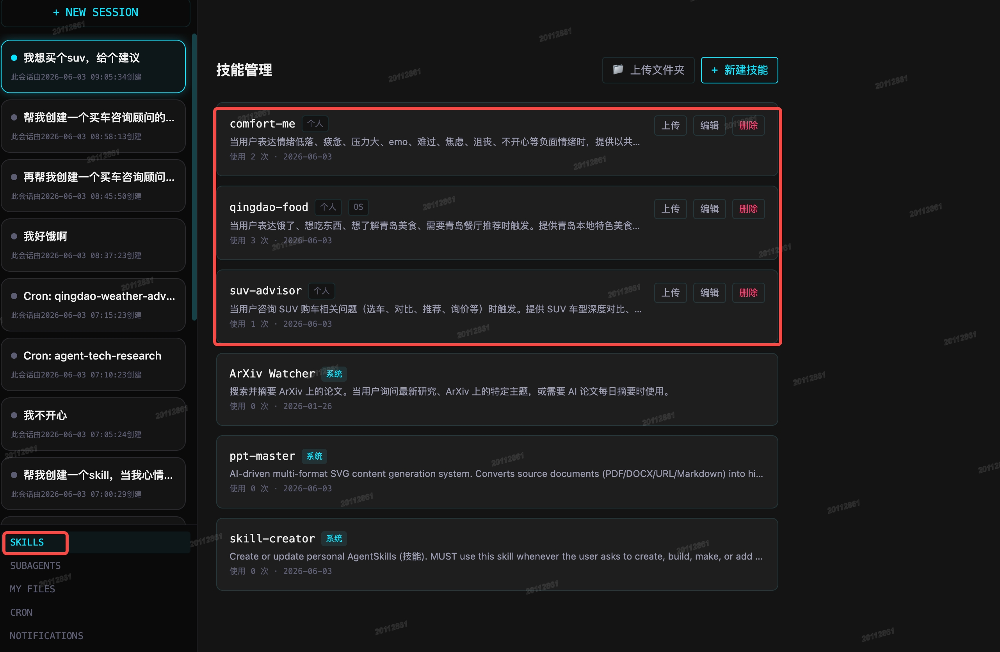

# SaaSClaw — 企业级个人超级智能体

## 它是什么

SaaSClaw 是一个**可私有化部署的 SaaS 化个人超级智能体**。他的功能与其他超级个人助理类似，但是SaaSClaw支持SaaS化部署，特别适合在企业内部进行部署和使用。
而且相对于其他超级个人助理，它平衡了强大的灵活性和企业实践下的安全性，避免了其他超级个人助理误删本地文件、错误的执行危险命令等安全问题，并且解决了超级智能体操作企业内部业务系统时的安全问题。
限于时间问题，当前版本还是一个运行在单台机器（本地或者服务器）上的智能体，但是只要稍加改造，即可实现服务端运行在paas平台上，前端运行在个人浏览器上。现在他已经实现了基于用户的session、长短期记忆、定时任务、消息通知、用于自定义skill等的隔离，实现了智能体运行态的无状态化和SaaS化。

注：本项目当前阶段是部署在mac上的，后续会部署到服务器端。但是如果您现在就想部署在服务端，也很简单，只要稍作前端到SaaSClaw，SaaSClaw到redis、mysql的链接信息，并部署到pod中即可。


## 你可以通过他干什么

### 日常对话
您可以与SaaSClaw进行对话，如下图：


### 自主任务
你可以告诉他：帮我调研青岛的海鲜价格趋势，如下：

他会主动分析任务的复杂度，然后进行任务拆解，并调用工具逐步完成任务。在完成任务的过程中如果出现异常，他还会主动进行修复。任务执行完成之后，他会把结果流式返回给你，如下：

### SaaS化定时任务
区别于其他超级个人助理，SaaS化助理的定时任务的难点在于助理运行实例时无状态的，需要准确的提取与用户相关的状态（比如记忆），然后执行定时任务，并将执行结果准确触达用户。
你可以通过**自然语言**或者界面操作的方式进行定时任务的创建和管理，如下：

然后在cron管理界面即可看到您的定时任务，如下：

等到定时任务触发执行后，您会在页面右上角的通知信箱看到红点提示，点击进入即可查看任务的执行结果，如下：

而且定时任务有单独的会话，您可以查看定时任务的执行过程，如下：


### 使用预制skill
SaaS化超级助理的skill的难点在于，如果skill执行的结果是文件（比如ppt），而助理运行实例是无状态的，文件又必须持久化存储，则必须有一个SaaS化的文件系统。如下：
用户发起一个ppt创作任务，使用ppt-skill：

在经过任务拆解和工具执行后，得到了ppt的生成结果，如下：

最终的ppt文件在用户界面上的文件管理页面中可见，如下：


### 使用预制subagent
用户可以使用子智能体组件临时和永久的agent team，进行方案等的讨论。
当执行的结果是文件的时候，SaaS化超级助理的subagent的难点同上，解决方案也与skill类似。在此不做赘述。
当生成的结果是文本的时候，执行结果可以在对话流中实时流式的返回给用户。
### 创建和使用自定义skill
此功能已部分实现，用户可以通过自然语言或者使用/skill-creator来创建自己的只包含一个SKILL.md文件的skill。智能体在每轮对话启动的时候，会自动加载系统和用户级别的skill到上下文中。用户也可以通过/<skill-name>的方式来使用自己的skill。
特别值得提的是，因为SaaSClaw是无状态的saas化智能体，所以用户skill也是使用user_id进行隔离的，即用户只能看到和使用自己的skill，且使用方式和系统预制skill一致。


### 创建和使用自定义subagent
此功能尚未实现，敬请期待
### 查看消息通知
在用户界面的右上角和左下角均有消息入口，超级智能体产生的消息，都在此处展示，包括文本类消息，文本+文件链接的消息。尤其是有新消息产生时，右上角的信箱会有红点提醒，如下：

### 查看SaaSClaw为您生成的文件
用户界面有独立的入口为您管理超级智能体为您生成的文件，在这个界面上您可以下载、删除您的文件，如下：


## 核心特点

### 🧠 有记忆的智能体

不是每次对话从零开始。SaaSClaw 会自动提取对话中的关键信息形成短期记忆（STM），并在后台定时整合为长期记忆（LTM）。下次对话时，它会从记忆中检索相关内容注入到上下文中——包括定时任务执行时也会加载你的记忆。

### ⏰ 原生 SaaS 化

这是 SaaSClaw 区别于其他个人超级 AI 助手的最重要特性。它遵循标准的SaaS化系统的设计原则，服务是无状态的，数据层以`employee_id`进行索引和隔离。
他的会话数据、长短期记忆数据、个人信箱数据、个人文件数据、定时任务的配置、定时任务的执行，都是SaaS化存储的。

### 企业级场景的安全性
SaaSClaw 设计之初就考虑了企业级使用场景，采取了多项安全措施：
- 超级助理运行环境的安全：超级助理的运行环境是无状态的，他不会在这个环境下写、修改、删除任何数据。而且因为这个环境是标准的、无状态的环境，所以其内部必然没有企业或个人的敏感数据。所以原生规避了其他个人助理可能发生的本地环境误删等风险
- 企业内的其他系统的安全：众所周知，企业内部会有很多其他的业务系统，超级助理如果具有较高权限，则对这些系统的危害可谓是灾难性的。所以SaaSClaw采用了员工的数字分身体系，结合企业的账号权限系统，使用员工数字分身，对企业内的业务系统进行操作。

## 技术栈

| 层级 | 技术 |
|------|------|
| 后端框架 | Python FastAPI |
| 异步任务 | Celery + Redis |
| 数据库 | MySQL 8.0 (aiomysql) |
| 缓存 | Redis 7 |
| 搜索引擎 | Elasticsearch 8 |
| 对象存储 | MinIO (S3 兼容) |
| 容器隔离 | Docker SDK for Python |
| 前端 | React 19 + TypeScript + Tailwind CSS 4 + Vite 6 |
| 实时通信 | Server-Sent Events (SSE) |

## 安装与运行

### 1. 环境要求

#### 1.1 必须安装的软件

| 软件 | 最低版本 | 用途 | 验证命令 |
|------|---------|------|----------|
| Docker | 20.10+ | 运行 MySQL、Redis、ES、MinIO、调度器等容器 | `docker --version` |
| Docker Compose | v2.0+ | 编排多容器服务 | `docker compose version` |
| Python | 3.11+ | 运行 FastAPI 后端服务 | `python3 --version` |
| Node.js | 18+ | 构建前端 React 应用 | `node --version` |
| npm | 9+ | 安装前端依赖 | `npm --version` |
| pip | 23+ | 安装 Python 依赖 | `pip3 --version` |

#### 1.2 Docker 容器化服务

部署后会自动在 Docker 中运行以下容器：

| 容器 | 镜像 | 端口 | 用途 |
|------|------|------|------|
| mysql | mysql:8.0 | 3306 | 业务数据库，存储用户、会话、定时任务、记忆等 |
| redis | redis:7-alpine | 6379 | 缓存 + Celery 消息队列 Broker |
| elasticsearch | elasticsearch:8.13.4 | 9200 | 消息全文搜索引擎 |
| minio | minio/minio | 9000 / 9001 | 对象存储（文件产物）+ Web 控制台 |
| scheduler-beat | 项目构建 | — | Celery 定时调度器，每 30s 扫描到期任务 |
| scheduler-worker | 项目构建 | — | Celery 任务执行器，HTTP 分发到后端 |
| super-agent-nginx | nginx:alpine | 3000 | 前端静态文件 + API 反向代理 |

#### 1.3 端口占用说明

部署前请确保以下端口未被占用：

| 端口 | 服务 | 冲突时的处理 |
|------|------|-------------|
| 3000 | 前端页面 (Nginx) | 可修改 `nginx/nginx.conf` 中的 `listen` 端口 |
| 3306 | MySQL | 如本地已有 MySQL 请先停止 |
| 6379 | Redis | 如本地已有 Redis 请先停止 |
| 8000 | FastAPI 后端 | 可修改 `deploy.sh` 中的启动端口 |
| 9000 | MinIO API | 可修改 `docker-compose.yml` |
| 9001 | MinIO 控制台 | 可修改 `docker-compose.yml` |
| 9200 | Elasticsearch | 可修改 `docker-compose.yml` |

### 2. 必需配置

#### 2.1 LLM 大模型配置（必须）

SaaSClaw 本身不提供大模型，需要对接你自己的 LLM API。在 `.env` 中配置以下变量：

```bash
# ── LLM API 地址 ──
# 阿里云百炼（DeepSeek 等）
OPENAI_API_BASE=https://dashscope.aliyuncs.com/compatible-mode/v1
# OpenAI 官方
# OPENAI_API_BASE=https://api.openai.com/v1
# 其他兼容 OpenAI 接口的服务均可使用

# ── API 密钥（支持多个，逗号分隔或 JSON 数组）──
OPENAI_API_KEYS=["sk-your-api-key-here"]

# ── 模型名称 ──
DEFAULT_MODEL=deepseek-v4-pro          # Agent 默认使用的模型
DEFAULT_DELEGATE_MODEL=deepseek-v4-pro # 子智能体使用的模型
COMPRESS_MODEL=deepseek-v4-pro         # 上下文压缩使用的模型

# ── 可用模型列表（JSON 数组）──
AVAILABLE_MODELS=["deepseek-v4-pro"]

# ── 模型降级链（JSON 对象，当前模型不可用时自动切换）──
FALLBACK_CHAIN={"deepseek-v4-pro":[]}
```

#### 2.2 Embedding 模型配置（可选，用于记忆搜索增强）

```bash
EMBEDDING_MODEL=text-embedding-3-small    # embedding 模型名称
EMBEDDING_API_BASE=                       # embedding API 地址，留空则复用 OPENAI_API_BASE
EMBEDDING_API_KEY=                        # embedding API 密钥，留空则复用 OPENAI_API_KEYS[0]
EMBEDDING_DIM=2560                       # embedding 向量维度
```

#### 2.3 对象存储配置

```bash
# 默认为 MinIO（Docker 部署），一般无需修改
OBJECT_STORAGE_BACKEND=minio
OBJECT_STORAGE_ENDPOINT=http://localhost:9000
OBJECT_STORAGE_BUCKET=super-agent
OBJECT_STORAGE_ACCESS_KEY=minioadmin
OBJECT_STORAGE_SECRET_KEY=minioadmin123
```

#### 2.4 自动生成的配置

以下配置由 `deploy.sh` 自动生成，无需手动填写：

- `JWT_SECRET` — 用户认证签名密钥（部署时随机生成）
- `INTERNAL_API_TOKEN` — 调度器与后端通信的鉴权 Token（部署时随机生成）

### 3. 一键部署

```bash
# 1. 克隆仓库
git clone <仓库地址>
cd SaaSClaw

# 2. 一键部署
./deploy.sh
```

脚本按顺序执行以下步骤：

1. **环境检查**：验证 Docker、Python、Node.js 是否安装且版本满足要求
2. **配置初始化**：从 `.env.example` 创建 `.env`，自动生成密钥和 Token
3. **启动基础设施**：`docker compose up -d mysql redis elasticsearch minio`，等待 MySQL 和 Redis 就绪
4. **启动后端**：`pip install -r requirements.txt`，然后 `uvicorn app.main:app --host 0.0.0.0 --port 8000` 后台运行
5. **构建前端**：`cd frontend && npm install && npm run build`
6. **启动调度器**：`cd scheduler && docker compose up -d --build`（Celery Beat + Worker）
7. **启动前端服务**：启动 Nginx 容器，监听 3000 端口，代理 API 到 8000 端口

### 4. 部署后检查

```bash
# 查看所有服务状态
./deploy.sh --status

# 应看到以下服务全部运行中：
#   ● mysql              运行中
#   ● redis              运行中
#   ● elasticsearch      运行中
#   ● minio              运行中
#   ● fastapi            运行中  (本地, PID=xxxxx)
#   ● scheduler-beat     运行中
#   ● scheduler-worker   运行中
#   ● nginx (前端)       运行中
```

如果某项未运行，查看日志排查：

```bash
tail -f logs/fastapi.log                    # 后端日志
docker logs scheduler-worker                 # 调度器日志
docker logs mysql                            # MySQL 日志
```

### 5. 配置 LLM（必须）

**这是唯一必须手动完成的配置**。编辑 `.env` 文件，填写你的 LLM API 地址和密钥，然后重启：

```bash
# 编辑配置
vi .env
# 至少修改：OPENAI_API_BASE、OPENAI_API_KEYS、DEFAULT_MODEL

# 重启后端
./deploy.sh --stop
./deploy.sh
```

### 6. 访问

| 地址 | 说明 |
|------|------|
| `http://localhost:3000` | 前端页面 |
| `http://localhost:8000/bx/api/docs` | API 文档 (Swagger) |
| `http://localhost:9001` | MinIO 对象存储控制台 |

### 7. 创建第一个定时任务（示例）

1. 登录后，左侧导航进入 **Cron** 页面
2. 点击「新建任务」
3. 填写以下内容：
   - **名称**：给任务起个名字，比如「日报汇总」
   - **Prompt**：用自然语言描述任务，比如「查询青岛今天的天气，包括温度、天气状况、风力、湿度，整理成报告」
   - **Cron 表达式**：设置执行频率，可以从预设中选择（每分钟/每小时/每天/每周/每月），也可以手写标准 5 位 cron 表达式
4. 保存后，任务会在下一次触发时间自动执行
5. 执行结果会通过 SSE 实时推送到页面右上角的通知信箱（红点提示）

### 8. 停止服务

```bash
./deploy.sh --stop    # 停止所有服务（保留数据和配置）
```

### 9. 常见问题

**Q: 部署时提示端口被占用？**
修改 `docker-compose.yml` 中对应服务的 `ports` 映射，以及 `nginx/nginx.conf` 中的前端端口。

**Q: 调度器日志报 `due=0`？**
正常现象。只有当某个定时任务的 `next_run_at` 小于等于当前时间时才会执行。可以手动将 `next_run_at` 改为过去的时间来触发测试。

**Q: 前端能打开但对话无响应？**
检查 `.env` 中的 LLM 配置是否正确，尤其是 `OPENAI_API_BASE` 和 `OPENAI_API_KEYS`。查看后端日志 `tail -f logs/fastapi.log` 确认错误信息。

**Q: 如何查看调度器是否正常工作？**
```bash
docker logs -f scheduler-worker
```
正常日志应为每 30s 一次 `Scan: total=X active=X due=0`（或 `due=N` 表示有 N 个到期任务）。

## 联系开发者

- 开发者名称：boxiao
- 邮箱：[1668703867@qq.com](mailto:1668703867@qq.com)
- 欢迎反馈问题、提出建议或交流技术。

## License

```
SaaSClaw/
├── app/                    # FastAPI 后端
│   ├── agent/              # Agent 核心（规划、执行、子智能体）
│   ├── api/v1/             # API 路由
│   │   └── internal/       # 内部 API（调度器通信）
│   ├── dao/                # 数据访问层
│   ├── db/                 # 数据库初始化与迁移
│   ├── middleware/         # 认证、错误处理中间件
│   └── sse/                # SSE 事件类型定义
├── scheduler/              # 独立调度器（Celery）
├── frontend/               # React 前端
│   └── super-agent-chatui/
├── nginx/                  # Nginx 配置（前端静态服务）
├── docker-compose.yml      # 基础设施编排
├── deploy.sh               # 一键部署脚本
└── .env.example            # 环境变量模板
```

## License

Proprietary. All rights reserved.

---

## 关键词 / Keywords

**核心场景（中文）：** SaaS化个人超级助理、SaaS化超级智能体、SaaS化超级助理、SaaS化智能体、企业级AI助理、多用户AI智能体、可私有化部署AI助理、企业内AI助理部署、企业安全AI智能体、员工数字分身AI、有记忆的AI助理、AI长短期记忆、无状态AI智能体、AI定时任务、自然语言定时任务、自主任务拆解AI、AI文件管理、企业内部大模型助理、OpenAI兼容智能体

**Core Scenarios (English):** saas super agent, saas super assistant, saas intelligent agent, saas ai agent platform, enterprise saas ai assistant, multi-user ai agent, self-hosted ai assistant, private deployment llm agent, enterprise ai security, stateless ai agent, ai long-term memory, ai short-term memory, autonomous task decomposition, ai scheduled tasks, natural language cron job, ai file management, employee digital twin, openai compatible agent, corporate ai assistant, on-premise ai assistant